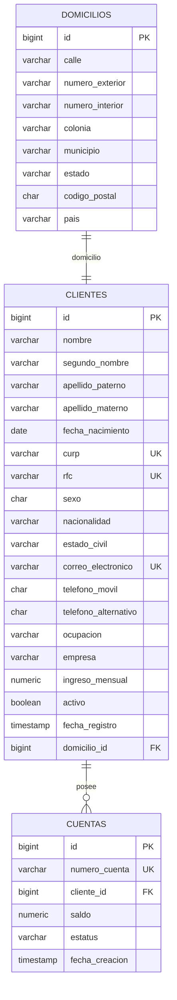

# Proyecto Integrador: Onboarding de Clientes Personas Físicas

## 1. Descripción y Objetivo

Este módulo implementa el flujo integral de **Onboarding de Clientes Personas Físicas** para una institución financiera, cumpliendo con los requerimientos funcionales, reglas de negocio bancarias, persistencia en base de datos relacional y validaciones declarativas.

Al registrar un cliente, el sistema valida rigurosamente sus datos personales, laborales y de contacto, crea su domicilio y le asigna automáticamente una **cuenta bancaria activa** con un número de cuenta único generado por secuencia y saldo inicial definido por el sistema.

---

## 2. Modelo de Datos y Persistencia (PostgreSQL & Flyway)

La migración `V3__create_clientes_cuentas.sql` estructura las tablas con sus llaves primarias, foráneas, restricciones de integridad e índices:



### Características del Esquema:
- **Identificadores**: `BIGINT GENERATED BY DEFAULT AS IDENTITY`.
- **Formato y longitudes exactas**: Código postal (5 dígitos), teléfonos (10 dígitos), CURP (18 caracteres con regex), RFC (12 o 13 caracteres con regex).
- **Mayoría de edad garantizada**: Restricción `CHECK (fecha_nacimiento <= CURRENT_DATE - INTERVAL '18 years')`.
- **Índice único case-insensitive**: `CREATE UNIQUE INDEX uq_clientes_correo_lower ON clientes (LOWER(correo_electronico))`.
- **Generación de Cuenta**: Secuencia `cuentas_numero_seq` que garantiza número único de 16 dígitos con prefijo `4`.
- **Saldo e integridad**: Saldo `NUMERIC(19, 2)` con `CHECK (saldo >= 0)`.

---

## 3. Arquitectura y Componentes Java (Spring Boot)

### Entidades JPA:
- `Cliente`: Datos personales, contacto, laborales y relación `@OneToOne` con `Domicilio` y `@OneToMany` con `Cuenta`.
- `Domicilio`: Ubicación física normalizada.
- `Cuenta`: Cuenta bancaria con saldo, número único y estatus `ACTIVA`/`INACTIVA`.

### Repositorios JPA:
- `ClienteRepository`: Búsquedas por CURP, RFC, correo (case-insensitive), estado activo, fecha de registro y existencia.
- `CuentaRepository`: Búsquedas por número de cuenta, estatus y cliente asociado.
- `DomicilioRepository`: Persistencia de domicilios.

### Servicios de Negocio:
- `ClienteService`: Registro transaccional de cliente + cuenta, consultas especializadas, actualización restringida (sin alterar CURP, RFC ni cuenta) y baja lógica en cascada.
- `CuentaService` / `CuentaServiceImpl`: Consulta de cuentas por número, saldo disponible y cuentas activas.

---

## 4. Catálogo de Endpoints REST

### Clientes (`ClienteController` - `/clientes`)
| Método | Endpoint | Descripción |
| :--- | :--- | :--- |
| `POST` | `/clientes` | Registra cliente persona física, domicilio y crea cuenta automática |
| `GET` | `/clientes` | Consulta todos los clientes registrados |
| `GET` | `/clientes/activos` | Consulta clientes con estatus activo |
| `GET` | `/clientes/{id}` | Consulta cliente por identificador ID |
| `GET` | `/clientes/curp/{curp}` | Consulta cliente por CURP |
| `GET` | `/clientes/rfc/{rfc}` | Consulta cliente por RFC |
| `GET` | `/clientes/correo/{correo}` | Consulta cliente por correo electrónico (path variable o query param) |
| `GET` | `/clientes/cuenta/{numeroCuenta}` | Consulta cliente titular por número de cuenta |
| `GET` | `/clientes/registrados?desde=YYYY-MM-DD&hasta=YYYY-MM-DD` | Consulta clientes registrados en un rango de fechas |
| `PUT` | `/clientes/{id}` | Actualiza completamente datos personales, contacto, laborales y domicilio (protege CURP, RFC y cuenta) |
| `PATCH` | `/clientes/{id}` | Actualización parcial: modifica campos específicos (contacto, trabajo, domicilio o estatus activo) |
| `DELETE` | `/clientes/{id}` | Desactiva lógicamente al cliente (activo = false) e inactiva sus cuentas, preservando su información en BD |
| `POST` | `/clientes/{id}/desactivar` | Endpoint alternativo para baja lógica del cliente y sus cuentas |

### Cuentas (`CuentaController` - `/cuentas`)
| Método | Endpoint | Descripción |
| :--- | :--- | :--- |
| `GET` | `/cuentas/{numeroCuenta}` | Consulta detalle de la cuenta bancaria por su número |
| `GET` | `/cuentas/{numeroCuenta}/saldo` | Consulta saldo disponible de la cuenta (`SaldoResponse`) |
| `GET` | `/cuentas/activas` | Lista todas las cuentas bancarias activas |

### Autenticación y Sesiones (`AuthController` - `/auth`)
| Método | Endpoint | Descripción |
| :--- | :--- | :--- |
| `POST` | `/auth/login` | Inicia sesión con correo y contraseña. Alerta HTTP 401 si son distintos a los registrados. Inicia temporizador de inactividad de 5 minutos. |
| `GET` | `/auth/validar-sesion` | Valida sesión activa y segundos restantes. Reinicia el contador de inactividad si hay actividad. Alerta HTTP 401 si se superaron los 5 minutos de inactividad (cierre automático). |
| `POST` | `/auth/logout` | Cierra manualmente la sesión activa en base de datos. |
| `POST` | `/auth/registro` | Registra nuevos usuarios administradores/operadores. |

---

## 5. Reglas de Validación Estrictas

1. **Campos de Texto**: Solo deben aceptar letras y espacios (`^[\p{L}]+(?: [\p{L}]+)*$`). No aceptan números ni caracteres especiales (`nombre`, `segundoNombre`, `apellidoPaterno`, `apellidoMaterno`, `nacionalidad`, `ocupacion`, `municipio`, `estado`, `pais`).
2. **Campos Numéricos**: Solo deben aceptar números (`telefonoMovil` 10 dígitos, `telefonoAlternativo` 10 dígitos, `codigoPostal` 5 dígitos, `numeroExterior` 1-15 dígitos).
3. **Valores de Catálogo con Alerta Explícita**:
   - **Sexo**: Texto tal cual: `Masculino`, `Femenino`, `Otro`.
     - *Alerta*: `"Alerta: El valor ingresado para 'sexo' no es aceptado en el catálogo. Valores permitidos: Masculino, Femenino, Otro"`
   - **Estado Civil**: Formato capitalizado (primera mayúscula y luego minúsculas, sin caracteres especiales): `Soltero`, `Casado`, `Divorciado`, `Viudo`, `Union libre`.
     - *Alerta*: `"Alerta: El valor ingresado para 'estadoCivil' no es aceptado en el catálogo. Valores permitidos: Soltero, Casado, Divorciado, Viudo, Union libre"`
   - **Nacionalidad**: Catálogo de gentilicios reconocidos (`Mexicana`, `Mexicano`, `Estadounidense`, `Canadiense`, `Española`, `Español`, `Colombiana`, `Colombiano`, `Argentina`, `Argentino`, etc.).
     - *Alerta*: `"Alerta: El valor ingresado para 'nacionalidad' no es aceptado en el catálogo. Valores permitidos: Mexicana, Estadounidense, Canadiense, Española, Colombiana, Argentina, etc."`
4. **Campos Numéricos con 2 Decimales**: `ingresoMensual` valida estrictamente hasta 2 decimales (`@Digits(integer=17, fraction=2)`).
5. **Requisito Obligatorio de Comillas `""`**:
   - Para hacer el registro de **cualquier dato**, el payload JSON debe enviarlo obligatoriamente delimitado entre comillas dobles `""` (incluyendo montos numéricos como `"ingresoMensual": "35000.00"`, `"telefonoMovil": "5512345678"`, `"codigoPostal": "06760"`, etc.).
   - Si cualquier dato se envía sin comillas (por ejemplo como número JSON sin comillas `35000.00`), se rechaza la solicitud y se devuelve la alerta:
     `"Alerta: Para hacer el registro de cualquier dato debes de tomarlo únicamente con comillas \"\"."`
6. **Formato de Fechas**: Estrictamente `AAAA-MM-DD` (`uuuu-MM-dd` / `yyyy-MM-dd`). Cualquier formato inválido emite una alerta estructurada.
7. **Autenticación (Login)**:
   - Alerta si el correo y la contraseña son distintos a los registrados (HTTP 401).
   - Temporizador de inactividad de **5 minutos** gestionado en base de datos (`sesiones_usuario`), que se reinicia con la actividad y se cierra automáticamente al superarse el tiempo límite.

---

### Biometría Facial (`BiometriaController` - `/clientes/{id}/biometria`)
| Método | Endpoint | Descripción |
| :--- | :--- | :--- |
| `POST` | `/clientes/{id}/biometria` | Registra datos biométricos faciales de MediaPipe (vector de embedding, confianza, rostros y foto) |
| `GET` | `/clientes/{id}/biometria` | Consulta el estatus y metadatos de la biometría registrada para el cliente |
| `POST` | `/clientes/{id}/biometria/validar` | Compara un vector facial actual contra el registrado mediante similitud de coseno |

---

## 6. Manejo de Excepciones Personalizadas

Centralizado en `ClienteExceptionHandler` con códigos HTTP estándar y respuesta en formato JSON estructurado:

- **`CredencialesInvalidasException`**: Alerta cuando el correo o contraseña son distintos (HTTP 401 Unauthorized).
- **`SesionExpiradaException`**: Alerta de sesión cerrada automáticamente por inactividad tras superar 5 minutos (HTTP 401 Unauthorized).
- **`SesionInvalidaException`**: Token inexistente o inválido (HTTP 401 Unauthorized).
- **`ClienteYaRegistradoException`**: Base para conflictos de registro (HTTP 409 Conflict).
  - **`CurpDuplicadaException`**: CURP ya registrada previamente.
  - **`RfcDuplicadoException`**: RFC ya registrado previamente.
  - **`CorreoDuplicadoException`**: Correo electrónico duplicado.
  - **`ClienteDuplicadoException`**: Genérico de duplicidad.
- **`ClienteNoEncontradoException`**: Cliente no encontrado (HTTP 404 Not Found).
- **`CuentaNoEncontradaException`**: Cuenta no encontrada (HTTP 404 Not Found).
- **`BiometriaNoEncontradaException`**: Biometría no registrada para el cliente (HTTP 404 Not Found).
- **`ErrorValidacionException`**: Validación de lógica de negocio o parámetros incorrectos (HTTP 400 Bad Request).
- **`MethodArgumentNotValidException`**: Errores en anotaciones de validación (HTTP 400 Bad Request con alertas descriptivas).
- **`HttpMessageNotReadableException`**: Captura errores de parseo de fechas y números mal formateados.

---

## 7. Verificación y Pruebas Unitarias

Para ejecutar el conjunto completo de pruebas automatizadas:

```bash
.\gradlew.bat test
```

Incluye suites de prueba exhaustivas:
- `ClienteServiceTest`: Verificación de creación transaccional, saldo inicial, duplicidades de CURP/RFC/correo, búsquedas, actualización y baja lógica.
- `CuentaServiceImplTest`: Consulta de cuentas, validación de saldos y cuentas activas.
- `ClienteRequestValidationTest`: Validación de Bean Validation (mayoría de edad, formatos regex, solo texto, solo números, catálogo sexo/estado civil, 2 decimales).
- `AuthServiceTest` y `AuthControllerTest`: Verificación de login, credenciales incorrectas, token, temporizador de 5 minutos, reinicio por actividad, cierre automático y logout.
- `BiometriaServiceTest` y `BiometriaControllerTest`: Registro de biometría, validación de dimensiones, cálculo de similitud coseno facial y endpoints REST.